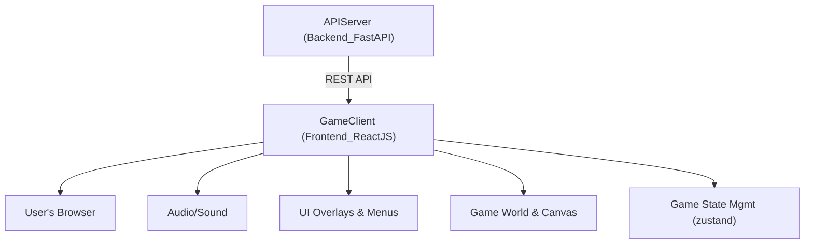
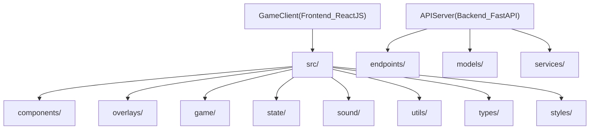

# PixelQuest Architecture & Integration Overview

This document describes the architecture, extensibility, separation of concerns, and integration strategy of **PixelQuest** across both the GameClient (Frontend_ReactJS) and APIServer (Backend_FastAPI) containers.

---

## Solution Structure

---

## 1. GameClient (Frontend_ReactJS)

### Purpose
Implements all core gameplay, game state, UI/UX, input handling, and rendering for PixelQuest, entirely client-side for the initial release.

### Key Implementation Structure
- **Entry Point:** `src/index.tsx` renders the React `<App />` to the DOM.
- **Orchestration:** `src/App.tsx` coordinates overlay menus, game canvas, audio context, and handles keyboard/global input.
- **Game Logic:**
    - **State Management:** `zustand` store (`src/state/gameStore.ts`) holds all game, UI, and overlay state. Extensible with more state slices as features grow.
    - **Rendering:** `GameCanvas.tsx` + `game/rendering.ts` delivers a crisp, pixel-art canvas, scales responsively for mobile/desktop.
    - **UI/UX Overlays:** Modular menu components under `src/overlays` (MainMenu, PauseMenu, HUD, SettingsMenu). Easily extended for new menus or dialogs.
    - **Audio:** `sound/AudioProvider.tsx` offers centralized (stub-implemented) sound/music—pluggable for more tracks and SFX as needed.
    - **Types:** `types/index.ts` enforces strict structure for player, level, and game state.
    - **Persistence:** `state/saves.ts` provides local (browser) saving/loading for player progress.

### Extensibility Points
- **New Abilities/Actions:** Add to `types/index.ts` and extend `gameStore`, `input.ts`, and UI overlays.
- **Menus/Settings:** New overlays/components plugged into `App.tsx`.
- **Backend Integration:** `src/utils/api.ts` is reserved for asynchronous API calls (e.g., leaderboards), supporting later full backend connectivity.

### Separation of Concerns
- **Game logic, UI, audio, state, and communication are each sharply isolated by folder/module.**
- **No backend dependencies required for single-player and most gameplay features.**

---

## 2. APIServer (Backend_FastAPI)

### Purpose
Reserved for future extensibility—handles prospective features such as online leaderboards, multiplayer, or cloud save. Not required in initial (offline) versions.

### Structure
- **Entrypoint:** `main.py` (bootstraps FastAPI app, sets up routers)
- **Routing:** `endpoints/` packages and modularizes feature-specific routes. Currently includes:
    - `root.py` – Root API `/`
    - `health.py` – `/health` readiness probe
- **Models:** `models/` (for Pydantic request/response schemas—add as backend features expand)
- **Services:** `services/` (for future business/domain logic)
- **OpenAPI & Docs:** Swagger UI enabled at `/docs` by default

### Extensibility Strategy
- Add new endpoints under `endpoints/`.
- Extend data models in `models/`.
- Implement business logic/services in `services/`.
- Modular design keeps new features isolated and testable.

### Separation of Concerns
- **No gameplay, world logic, or UI is handled server-side.** The server will only provide backend services for cloud capabilities or integrations.

---

## 3. Integration & Cross-Container Strategy

### Integration Overview
- **Current Release:** No mandatory cross-container API calls; all gameplay is local.
- **API Design:** The GameClient is prepared for REST API integration—`utils/api.ts` will connect to `APIServer` endpoints (e.g., `/leaderboard`, `/save`) as backend features roll out.
- **CORS:** Backend is configured (in `main.py`) to allow cross-origin requests for seamless frontend/backend communication in development and production.

### Extensibility for Online Features
1. **Add a server endpoint in APIServer (`endpoints/`)**: e.g., `/leaderboard`
2. **Implement client utils/api handler** in GameClient: asynchronous fetch logic.
3. **Interface via zustand store or React hooks:** keep UI responsive and decoupled from backend errors.

---

## 4. Key Principles

- **Loose Coupling:** Frontend and backend can evolve and deploy independently.
- **Scalable & Testable:** Each slice (state, UI, backend logic) architected for ease of extension, rapid prototyping, and unit or integration testing.
- **Clear Models:** Data/response structures defined in one place—strict typing with TypeScript (frontend), Pydantic (backend).
- **UI/UX Clarity:** Menus, overlays, and game canvas separated for readability and contribution.

---

## 5. Folder Structure Reference (Simplified)

---

## 6. Future Directions

- **Add authentication and real-time features to backend as multiplayer/online opens up.**
- **Enhance local state/persistence logic as single-player grows (multiple saves, cloud sync-ready design).**
- **Keep CORS, versioning, and modularity at the core for all backend/frontend changes.**

---

### For more details, see source code in each module/folder, or extend as noted!
